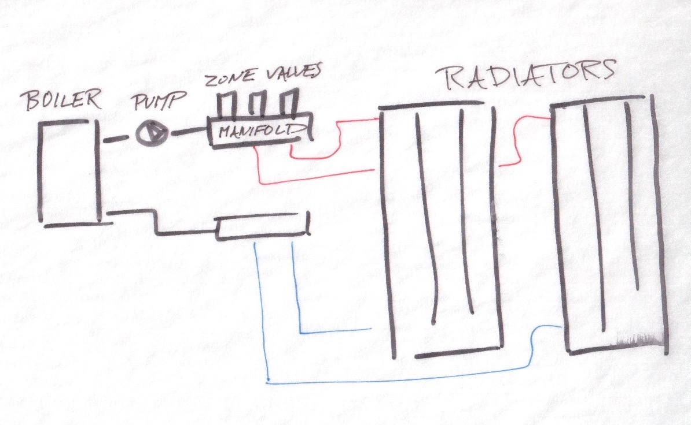
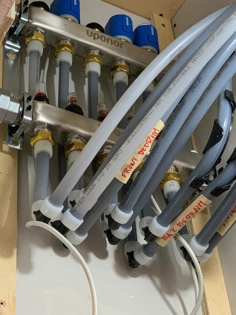
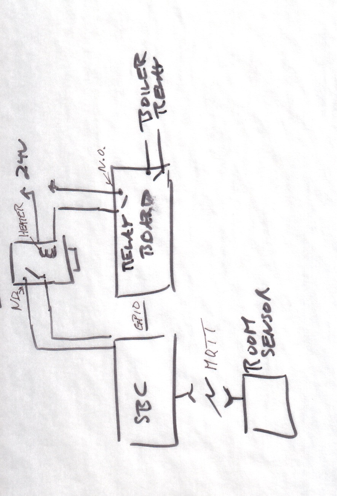
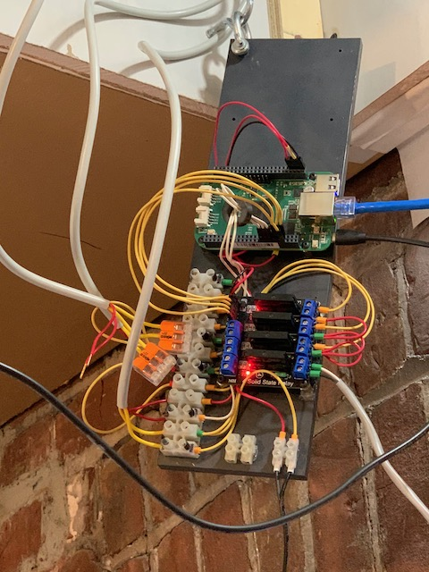
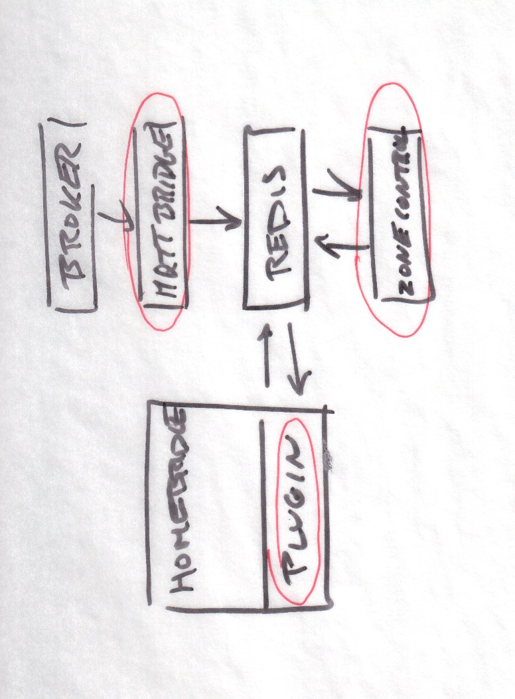
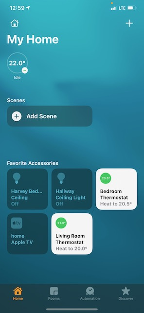

The philosophy guiding this project and its documentation is straightforward: get it working then make improvements as needed. Perfection is the enemy of progress.

# Plumbing

Overall the heating system is quite simple. A boiler is connected via a manifold with zone valves to a series of radiators. When a zone calls for heat, first the zone valve opens, and when that is complete, the boiler and pump are then turned on.

Manifold with zone valves

# Electronics
A beaglebone SBC running debian hosts all the software pieces as well as interfacing via GPIO to a relay board. The relays control the zone valves as well as the boiler

Beaglebone and relay board

# Software
This script contains the logic for zone and boiler control. Sensor data is sent to an MQTT broker (mosquitto in this case). A simple bridge written in python publishes these values to redis. The homebridge plugin reads and writes respective values to redis. Another script, again written in python, toggles the physical gpios based on these values.
The bits circled in red are the ones I've written. The UI is implemented as an  

